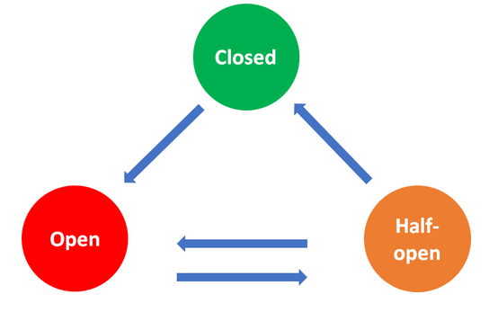

# Polly.NET

Maarten Vissers - 11-12-2021

[Polly](https://github.com/App-vNext/Polly) is a .NET **resilience** and **transient-fault-handling library** which uses **policies** to prevent or handle certain faults to keep your systems and customers connected. These policies, consisting of only a few lines of code, can be simultaneously reused and combined throughout your application. They provide support for Sync and aSync requests and are thread safe. Polly is available on all .NET platforms so it can run on your web services, desktop apps, mobile apps and inside your containers — anywhere .NET can run.

## Introduction to policies

As of .NET Core 2.1, policies can be attached directly to `HTTPClients` thanks to `HTTPClientFactory`. This is configured in the Startup.cs; or from .NET 6: Program.cs. 

Policies are divided into two **strategies**: reactive strategies and proactive strategies. 

- **Reactive policies**: these policies are used when a particular problem arises. For example, by re-executing a failed request. Also referred to as fault-handling policies
- **Proactive policies**: these policies are used to prevent a particular problem. For example, by limiting the number of resources used service.

### Reactive policies

Fault-handling (reactive) policies handle specific exceptions or results returned by the action performed by the policy.

When defining a policy, you describe the issues that the policy should respond to and how. To illustrate this, the example of a retry policy is used.

##### Handles clause

Describes the **faults or exceptions** **the policy should respond to**. In this example, the policy responds to a return value where the result is faulty or throws an `HttpRequestException`.

```c#
Policy
     .HandleResult<HttpResponseMessage>(r => !r.IsSuccessStatusCode)
     .Or<HttpRequestException>()
```

##### Behavior clause

Describes **the way to respond** when a particular fault occurs. In the example, we respond by retrying up to three times.

```csharp
Policy
  .Handle<SomeExceptionType>()
  .Retry(3)
```

### Proactive policies

These policies prevent certain problems by limiting the resources that are absorbed by a particular action, they are not based on handling faults which the governed code may throw or return.

To define a proactive policy, you describe the strategy that will be used. In the examples below, we use the timeout policy to illustrate how this works.

```csharp
Policy
  .Timeout(30)
```

### Inversion of control

Separate policy definition from policy consumption. It is recommended to do this by defining the policies in the Startup.cs and place them in a [`PolicyRegistry`](https://github.com/App-vNext/Polly/wiki/PolicyRegistry). Use an extensions method on `IServiceCollection` to register all policies separately.

```csharp
public static ConfigurePollyPolicies(this IServiceCollection services)
{
    PolicyRegistry registry = new PolicyRegistry()
    {
        { "RepositoryResilienceStrategy", /* define Policy or PolicyWrap strategy */ },
        { "CollaboratingMicroserviceResilienceStrategy", /* define Policy or PolicyWrap strategy */ },
		{ "ThirdPartyApiResilienceStrategy", /* define Policy or PolicyWrap strategy */ },
		/* etc */
    };

    services.AddSingleton<IReadOnlyPolicyRegistry<string>>(registry);
}
```

## Overview reactive policies

Which policies can you use exactly? Below all reactive policies are listed with code examples and suitable scenarios. 

### Retry

The Retry policy allows you to **retry a failed request** due to an exception or an unexpected result returned by the called code, **without waiting** before retrying. If the problem that caused the request to fail is not likely to be resolved almost immediately, a retry may not be useful; it might make things worse. The retry policy allows you to set the number of retries you want to perform before giving up.

```csharp
// Retry once
Policy.Handle<Exception>()
  .Retry()
  .Execute(Method);

// Retry forever
Policy.Handle<Exception>()
  .RetryForever()
  .Execute(Method);

// Retry up to 10 times
Policy.Handle<Exception>()
  .Retry(10)
  .Execute(Method);

// Retry and log exceptions
Policy.Handle<Exception>()
  .RetryForever(e => Log(e.Message))
  .Execute(Method);

// Retry result 
Policy.HandleResult<bool>(b => b != true)
    .Retry(3);

// OnRetry delegate
Policy.HandleResult<HttpResponseMessage>(r => !r.IsSuccessStatusCode)
    .RetryAsync(3, onRetry: (response, retryCount) =>
	{
        if (response.Result.StatusCode == HttpStatusCode.Unauthorized)
        {
            PerformReauthorization();
        }
    });
```

### Wait And Retry

It is quite common for a request to fail because of a temporary network or infrastructure fault - which resolves itself after a while. By throttling the execution of the retry mechanism, such minor flaws can be overcome.

Similar to the Retry policy, the Wait and Retry policy can handle exceptions and bad results in the called code with an additional parameter: the **delay** to be applied between each retry. This delay can be defined in several ways, such as a fixed period, an array of periods, or a func that calculates the delay for each retry.

```csharp
// Delay using an array
Policy.Handle<Exception>()
  .WaitAndRetry(new [] { TimeSpan.FromMilliseconds(100), TimeSpan.FromMilliseconds(200) })
  .Execute(PersistApplicationData);

// Calculated delay
Policy.Handle<Exception>()
  .WaitAndRetry(5, retryAttempt => TimeSpan.FromSeconds(retryAttempt))
  .Execute(PersistApplicationData);
```

### Circuit Breaker

If a piece of code you depend on becomes very unreliable, it may be best to stop making requests to it for a while to avoid the overhead of having to deal with all the occurring exceptions.

Once a certain threshold for the number of failures returned by the invoked code is reached, this policy blocks calls to this code for a predefined time. Polly offers two implementations of the circuit breaker: the Basic Circuit Breaker and the Advanced Circuit Breaker.

**Basic:** breaks when a defined number of consecutive faults occur.
**Advanced:** breaks when a threshold of failures occur within a time period, during which predefined number of requests were made.

```c#
// Basic: breaks for 60 seconds after 2 failures
Policy
  .HandleResult<HttpResponseMessage>(r => !r.IsSuccessStatusCode)
  .CircuitBreakerAsync(2, TimeSpan.FromSeconds(60));

// Advanced: breaks for 60 seconds when 50% of at least 7 requests in a timeperiod of 30 seconds failed
Policy
  .HandleResult<HttpResponseMessage>(r => !r.IsSuccessStatusCode)
  .AdvancedCircuitBreakerAsync(0.5, TimeSpan.FromSeconds(30), 7, TimeSpan.FromSeconds(60));
```

#### In depth - States

To determine the behavior of this policy, states are used. Depending on the configuration, the state will change upon receiving responses. Each state has its own behavior:

- **Closed**: The operational state, where requests and responses can go in and out. This is the initial state.
- **Open**: The fault state where no requests and responses can go in and out.
- **Half Open:** The test state where, depending on the first upcoming result, it is determined whether the state changes back to Closed or Open.



##### Example Of States

`CircuitBreakerAsync(2, TimeSpan.FromSeconds(60))`

By default, the policy is in the Closed state. After receiving 2 faulty results, the state is changed to Open for 60 seconds, no more requests and responses can go in and out. 

After this period of time, the state changes to Half-Open. If the next response that is received now is again faulty, the state changes back to the Open state for the same period of time and will eventually go back to the Half-Open state. If the next response in the Half-Open state is successful, the state of the policy changes back to Closed. Requests and responses can go in and out again.

### Fallback

Commonly used in combination with other policies as the last step of the chain. A request can fail, despite how many times you try, what policies you use... the fallback policy can be used to perform a backup action. 

```c#
Policy
	.Handle<Exception>()
	.FallbackAsync(async (cancellationToken) => await SaveOrderInQueue(order).ConfigureAwait(false));

// onFallback delegate
Policy
   .Handle<Exception>()
   .FallbackAsync(FallbackAction, onFallback: (exception, context) => 
    {
        // Add extra logic to be called when the fallback is invoked, such as logging
    });

```

In the example above failed requests are placed in a queue which can be executed later on.

## Overview proactive policies

Which policies can you use exactly? Below all proactive policies are listed with code examples and suitable scenarios. 

### Timeout

Determine the maximum time a request is allowed to wait for a response. When this time is exceeded, the request is cancelled. A lot of .NET libraries have a build-in timeout, but there are also many cases a timeout can still be added. 

```c#
Policy
  .Timeout(20)

// Delegate
Policy
  .Timeout(20, onTimeout: (context, timespan, task) => 
    {
        // Add extra logic to be invoked when a timeout occurs, such as logging 
    });
```

### Cache

Enables storing of results of a particular action. If a duplicate request is made, Polly returns the saved result from the cache instead of calling the underlying logic a second time.

```c#
var memoryCache = new MemoryCache(new MemoryCacheOptions());
var memoryCacheProvider = new MemoryCacheProvider(memoryCache);

Policy
    .Cache(memoryCacheProvider, TimeSpan.FromMinutes(5));

// Absolute expiration: at midnight.
Policy
    .Cache(memoryCacheProvider, new AbsoluteTtl(DateTimeOffset.Now.Date.AddDays(1));

// Sliding expiration: items remain valid for another 5 minutes each time the cache item is used.
Policy
	.Cache(memoryCacheProvider, new SlidingTtl(TimeSpan.FromMinutes(5));
                               
// Exception handling
Policy
	.Cache(myCacheProvider, TimeSpan.FromMinutes(5), 
       (context, key, ex) => { 
           logger.Error($"Cache provider, for key {key}, threw exception: {ex}."); // (for example) 
       });
```

### Bulkhead Isolation

Prevent a part of your application or an external service from taking up too many resources, by **limiting the maximum amount of concurrent requests** to this particular logic. In addition, you can add requests to a **queue**, which will not be executed until the maximum concurrent requests have been released.

Utilizing this policy provides you more control over the consumption of CPU, threads and sockets.

```c#
// Six concurrent action-slots.
Policy
  .Bulkhead(6)

// Six concurrent action-slots, twelve queue-slots.
Policy
  .Bulkhead(6, 12)
    
// Delegate
Policy
  .Bulkhead(12, 2, OnBulkheadRejectedAsync)
    
int freeExecutionSlots = bulkhead.BulkheadAvailableCount;
int freeQueueSlots = bulkhead.QueueAvailableCount;
```

### Rate Limit

Limits the amount of requests within a configured time span.

```c#
// Allow up to 20 executions per second.
Policy.RateLimit(20, TimeSpan.FromSeconds(1));

// Allow up to 20 executions per second with a burst of 10 executions.
Policy.RateLimit(20, TimeSpan.FromSeconds(1), 10);
```

## Using a policy

Perform certain logic using the policy, this can be a `Action`, `Func`, or lambda delegate equivalent

```csharp
policy.Execute(() => DoSomething());
```

### Attach to client

As of .NET Core 2.1, `HttpClientFactory` enables policies to be attached to HttpClients. As a result, the policies are automatically executed when using the HttpClient. When defining the policy you can specify which policies apply to which requestsdaa.

```c#
// Attach policies to a client
services.AddHttpClient<IRemoteService, RemoteService>(remote =>
{
    remote.BaseAddress = new Uri(Configuration["BaseUrl"]);
})
    .AddPolicyHandler(GetRetryPolicy())
    .AddPolicyHandler(GetCircuitBreakerPolicy());

// Implicit use of the policy
HttpResponseMessage respone = await httpClient.GetAsync(remoteEndpoint);
```


## Testing

In addition to tests that examine your application with the use of Polly, there are other options.

### NoOp

Define the behavior of your application as if Polly was not in place

```c#
NoOpPolicy noOp = Policy.NoOp();
```

### Simmy

Simmy is a [chaos-engineering](http://principlesofchaos.org/) and fault-injection tool, integrating with the **Polly resilience project for .NET**. It is releasing April 2019 and works with [Polly v7.0.0](https://www.nuget.org/packages/Polly/7.1.0) onwards.

Simmy allows you to introduce a chaos-injection policy or policies at any location where you execute code through Polly. Visit this [GitHub repo](https://github.com/Polly-Contrib/Simmy) for further information.
